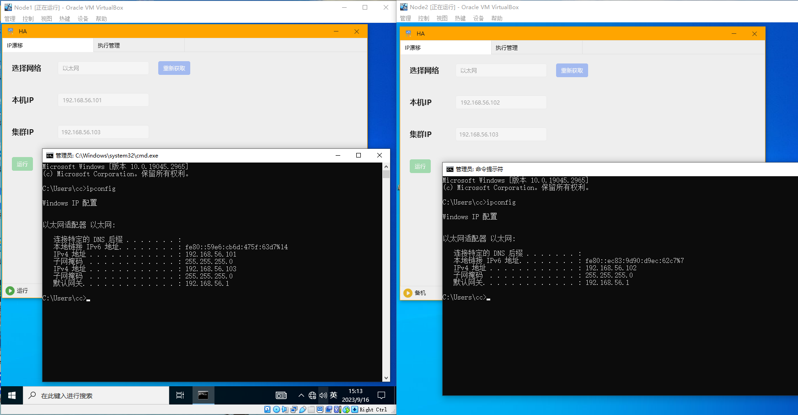
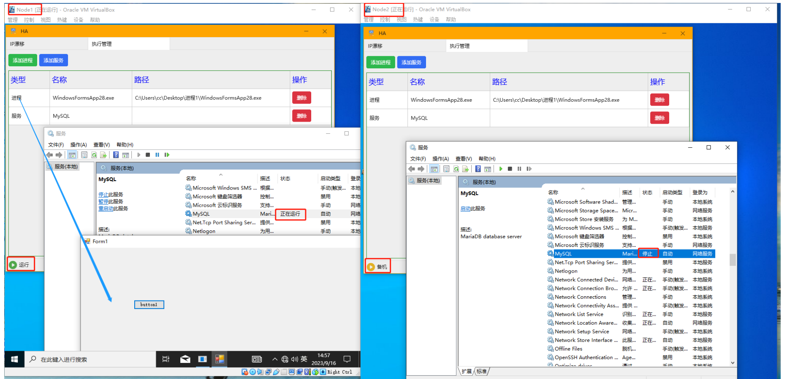

# PanguHA

#### Description
PanguHA is a dual machine cluster system on the Windows platform, providing a high availability solution for the system. It is generally composed of two nodes, divided into active and standby nodes.

#### Instructions

### 1.  IP drift
Provide a cluster IP externally, and this IP will always be set only on the active host. When a node goes down, this IP will automatically drift to the node that has not gone down. The backup node will be upgraded to the active node, and the IP of the system site and database can be set as the cluster IP to improve system availability without being aware of business.

### 2.  Execution Management
It can be used to set up processes and Windows service groups, and ensure that processes and Windows services only run on one node (active node).

### 3.  xxxx
Resource mirroring (under development)

