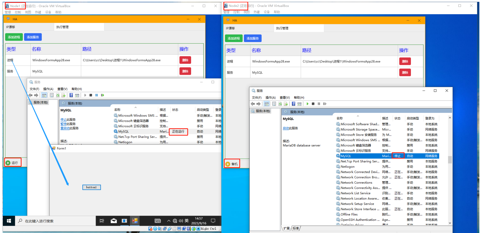

# PanguHA

#### 介绍
PanguHA是Windows平台的双机集群系统，是提供系统高可用性的解决方案，一般由两个节点构成，分为活动节点及备用节点。

#### 功能介绍

### 1. IP漂移
对外提供一个集群IP,并且该IP始终只会设置在活动主机上，当一台节点宕机，
该IP会自动漂移到未宕机的节点上，备用节点升级为活动节点，系统站点和数据库的IP可以设置为集群IP,
用于提高系统可用性，对业务无感知。
    
### 2. 执行管理 
可用于设置进程和windows服务组，并且保证进程和windows服务只会在一台节点上运行(活动节点)。
    
### 3. 资源镜像（开发中）

